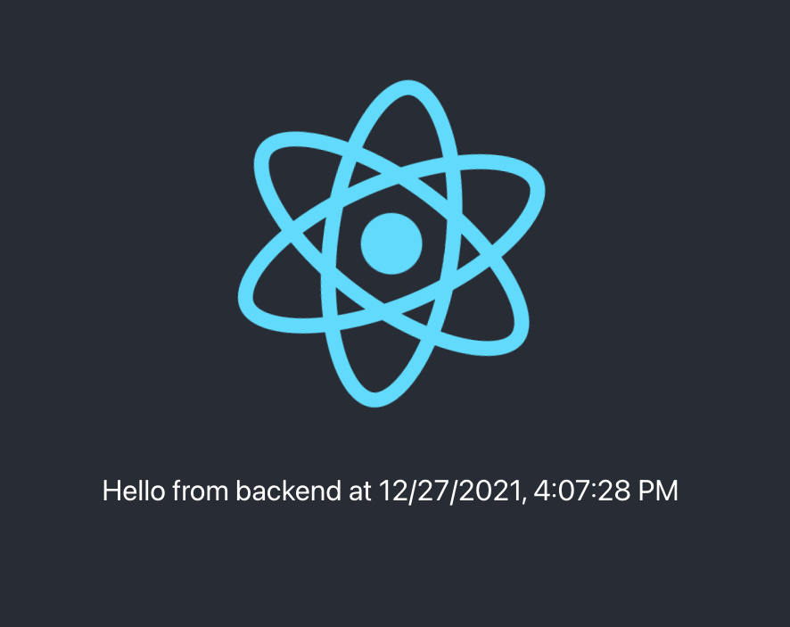

# Introduction

This repository represents a way to structure a backend Node.js application with a front-end React app in the same repo which can be containerized and deployed to Azure App Service.

## Table of Contents

- [Introduction](#introduction)
  - [Table of Contents](#table-of-contents)
  - [Architecture](#architecture)
  - [Structure of the code](#structure-of-the-code)
  - [Deployment instructions](#deployment-instructions)
    - [Environment Variables](#environment-variables)
    - [Azure Login](#azure-login)
      - [Create a Resource Group](#create-a-resource-group)
    - [Infrastructure deployment](#infrastructure-deployment)
    - [Build Container Locally](#build-container-locally)
  - [Run Container Locally](#run-container-locally)
  - [Build and Push to ACR](#build-and-push-to-acr)
  - [Run Code locally](#run-code-locally)
  - [SSH locally](#ssh-locally)
  - [SSH In the Azure Portal](#ssh-in-the-azure-portal)

## Architecture

The webapp is split into two main components, a node backend, and a React frontend.  While these can be run directly in production, it's also dockerized and can be used in a variety of architectures including on-cloud, on-prem, anywhere that supports docker containers.

## Structure of the code

Here is the structure of the webapp at a high level pointing out the notable directories/files.

```text
nodejs-react-container-app-service/
|__backend/
|  |__index.ts (The Node.js entry point)
|  |__src/ (All source code that runs the backend)
|  |__tests/ (Unit tests separated to this directory)
|  |__public/ (Used for Node.js to serve a static webapp, primary for production)
|__frontend/
|  |__build/ (where npm run build generates the static site)
|  |__src/ (All source code encapulated here)
|  |__index.tsx (Entry point for React)
|__|__App.tsx (Main React Component)
   |__components/ (All other React Components go here)
```

## Deployment instructions

### Environment Variables

Export these variables to use later, feel free to change the values as you please.

```text
export EXAMPLE_NAME="samuelexample"
export EXAMPLE_REGION="eastus2"
export EXAMPLE_RG="container-webapp-rg"
export EXAMPLE_CONTAINER_NAME="example"
export EXAMPLE_ACR_NAME="$(echo $EXAMPLE_NAME)acr"
```

Note that with the exception of the `REGION` you'll likely need to change the above names for your deployment.

### Azure Login

In your terminal run `az login`, once you login the command line will show you all applicable subscriptions.

Find the right subscription and set the subscription you want to deploy the resources to by `az account set -s <subscription-id>`

#### Create a Resource Group

Create the resource group given above if it does not already exist `az group create -l $EXAMPLE_REGION -n $EXAMPLE_RG`.

### Infrastructure deployment

Create `deployment/dev.tfvars` and configure the values.  An example you can modify is:

ex.

```text
echo "name            = \"$EXAMPLE_NAME\"" >> deployment/dev.tfvars
echo "region          = \"$EXAMPLE_REGION\"" >> deployment/dev.tfvars
echo "resource_group  = \"$EXAMPLE_RG\"" >> deployment/dev.tfvars
echo "container_name  = \"$EXAMPLE_CONTAINER_NAME\"" >> deployment/dev.tfvars
```

In the `deployment` directory run `tf init` then check that there are no errors from running `tf plan --var-file dev.tfvars`

Now apply: `tf apply --auto-approve --var-file dev.tfvars`

### Build Container Locally

Build docker with the following command:

```text
docker build -t $EXAMPLE_CONTAINER_NAME .
```

## Run Container Locally

For simple development you can run: `npm run start-dev` which will `concurrently` run the front and backend which will have hot-reload enabled.  Access the app at [http://localhost:3001].

If you want to test running in docker, after building docker in the command previously:

```text
docker run -p 22:2222 -p 80:3000 "$EXAMPLE_CONTAINER_NAME":latest
```

Access the app at [http://localhost](http://localhost).

## Build and Push to ACR

Build the docker image to the ACR.  Make sure you are in the root of the repo.

```text
az acr build --image "$EXAMPLE_CONTAINER_NAME":latest --registry "$EXAMPLE_ACR_NAME" --file Dockerfile .
```

## Run Code locally

If you don't want to run in a container, have two terminals open and run the following:

```text
cd backend
npm run dev
```

```text
cd frontend
npm run start
```



## SSH locally

You can connect to ssh locally with `ssh root@localhost` with the password given in the [https://docs.microsoft.com/en-us/azure/app-service/tutorial-custom-container?pivots=container-linux#connect-to-the-container-using-ssh](documentation).

## SSH In the Azure Portal

Once you push a new version of the container and it's deployed you can login to the SSH remotely in the browser via: [https://REPLACEWITHWEBAPPNAME.scm.azurewebsites.net/webssh/host].

Note: Replace `REPLACEWITHWEBAPPNAME` with the actual webapp name.

*[(Back to Table of Contents)](#table-of-contents)*
